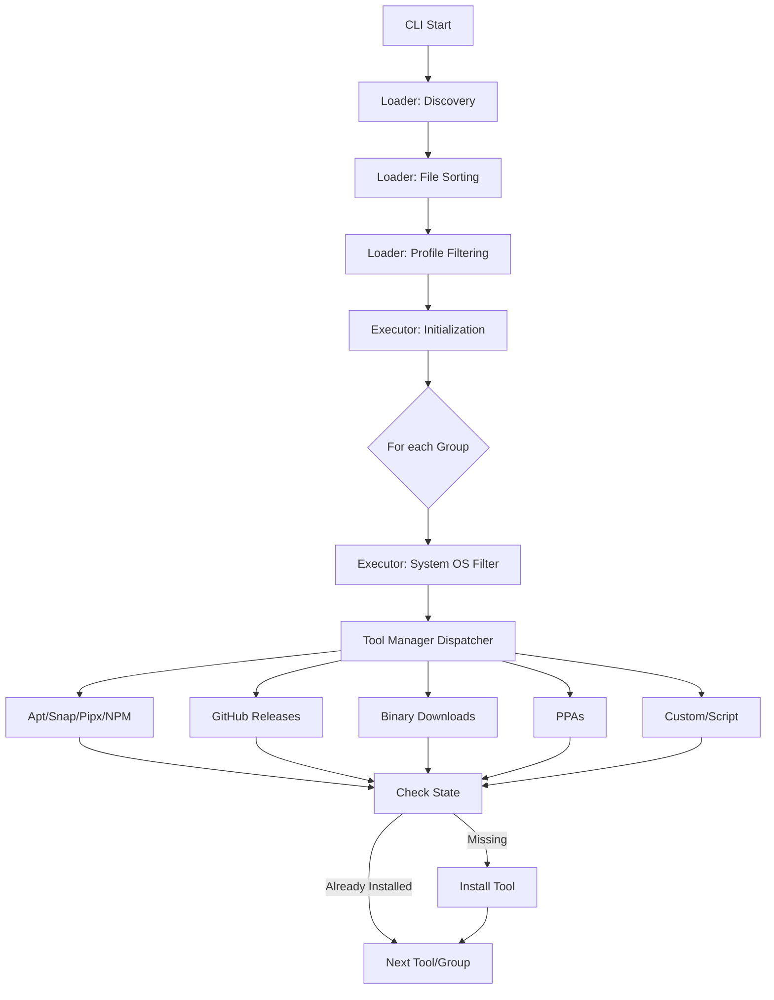
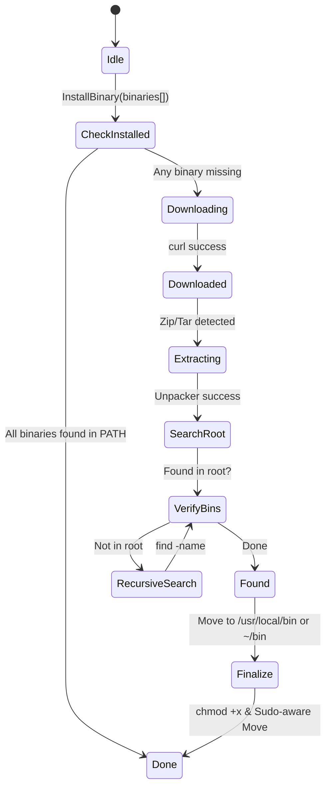

# Architecture Documentation

This document describes the internal architecture of the Go-based dotfile bootstrapper.

## System Overview

The bootstrapper follows a declarative, idempotent design. It sequences tool installations based on YAML configurations while ensuring that the system state is checked before any destructive or expensive operations (like downloads) are performed.



## Loader & Filtering Logic

The `Loader` is responsible for merging multiple YAML files into a single execution plan.

1.  **Discovery**: Scans `init/*.yaml`.
2.  **Sorting**: Files are executed in alphanumeric order (e.g., `01_base.yaml` -> `02_dev.yaml`).
3.  **Profile Filtering**: A group is included if `profile` matches the input flag, is empty, or is `"default"`.
4.  **System Filtering**: Handled at the executor level; a group is skipped if its `systems` string does not match the host OS.

## Binary Extraction State Machine

When installing tools from archives (GitHub or URL), the logic follows a specialized extraction path to handle complex nested structures and multiple binaries.



## Sudo Strategy

The system is designed to minimize `sudo` usage.

-   **Automatic Sudo**: `apt` and `snap` naturally request sudo via their own mechanisms.
-   **Context-Aware Sudo**: The `FinalizeBinaryInstall` tool checks if the target path is outside of `$HOME`. If so, it invokes `sudo` for `mkdir`, `mv`, and `chmod`.
-   **Interactive inheritance**: The Go process shares its `Stdin/Stdout/Stderr` with all sub-commands, allowing for native password prompts.

## Provider System

The bootstrapper uses a provider-based architecture where each installation method is implemented as a provider that adheres to the `Provider` interface.

### Provider Interface

```go
type Provider interface {
    ID() string
    Priority() int  // Execution order (lower = first)
    Install(config DependencyGroup, onComplete OnTaskComplete) error
}
```

Optional interfaces:
- `Setupable`: Providers can implement `Setup() error` for one-time initialization before installations
- `TearDownable`: Providers can implement `TearDown() error` for cleanup after all installations

### Provider Execution Priority

Providers execute in priority order (lower numbers first) to ensure dependencies are met:

- **Priority 10** (System Package Managers): `apt`, `brew` - Install system dependencies first
- **Priority 50** (Version Managers): `nvm`, `sdkman` - Require system tools (zip, unzip, curl)
- **Priority 100** (Application Installers): All others - Default priority for application-level tools

The registry automatically sorts providers by priority when executing installations.

### NVM Provider

The NVM provider manages Node.js versions through Node Version Manager:

**Features**:
- Automatic NVM installation from latest GitHub release
- Support for multiple Node.js versions with configurable default
- Version resolution: `lts/latest` resolves to the actual latest LTS version
- Automatic deduplication (default version is always included)
- Idempotent: verifies existing installations before downloading
- Fail-fast: stops immediately on any installation error

**Configuration Example**:
```yaml
- name: "Node.js"
  nvm:
    - default: "lts/latest"  # Resolves to actual latest LTS
      versions:
        - "lts/iron"         # Specific LTS codename
        - "18"               # Major version
```

**Implementation Notes**:
- Priority: 50 (version manager)
- NVM installation happens in `Setup()` phase before version installations
- Uses `bash -lc` for command execution to ensure login shell initialization
- Respects `NVM_DIR` environment variable, defaults to `~/.nvm`
- Does not modify shell configuration files (expects NVM installer to handle this)

### SdkMan Provider

The SdkMan provider manages JVM-based SDK versions (Java, Gradle, Maven, Kotlin, etc.):

**Features**:
- Automatic SdkMan installation if not present
- Automatic dependency installation (zip, unzip) based on OS
- Flexible configuration: string format or object format
- Support for multiple versions per SDK candidate
- Automatic default version configuration
- Idempotent: checks existing installations before downloading

**Configuration Examples**:
```yaml
- name: "Java/JVM Development (SdkMan)"
  sdkman:
    # Simple string format
    - "java:21.0.2-open"
    - "maven:3.9.10"
    
    # Object format with single version
    - candidate: "gradle"
      version: "8.14.3"
    
    # Object format with multiple versions
    - candidate: "kotlin"
      version: "1.9.0"      # default
      versions: ["2.0.0"]   # additional
```

**Implementation Notes**:
- Priority: 50 (version manager)
- Automatically installs zip/unzip via apt (Linux) or brew (macOS) if missing
- SdkMan installation happens in `Setup()` phase
- Uses `bash -lc` with sourcing of `$SDKMAN_DIR/bin/sdkman-init.sh`
- Respects `SDKMAN_DIR` environment variable, defaults to `~/.sdkman`
- Supports both simple string parsing (`candidate:version`) and structured object format
