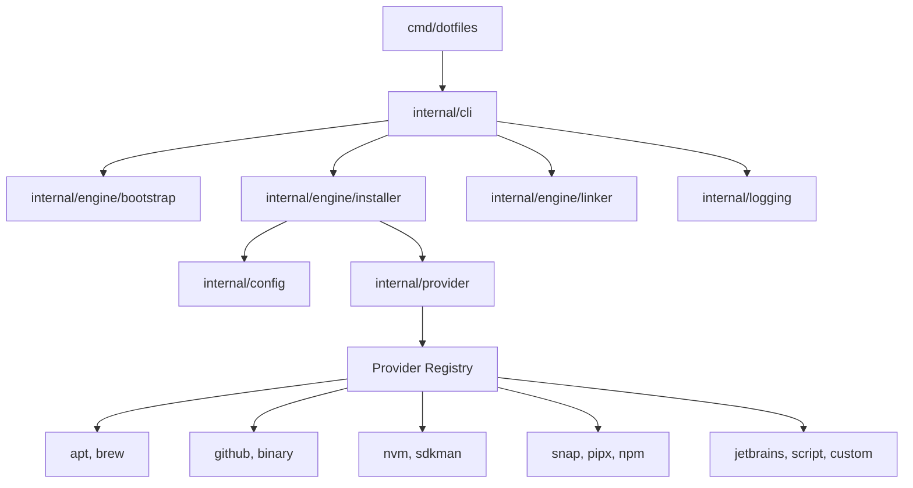
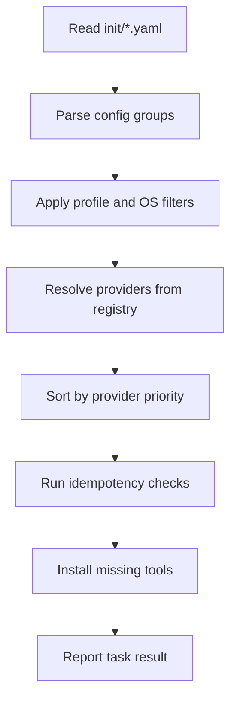

# Architecture

This repository contains the standalone Go CLI that bootstraps dotfiles and tool installation from declarative YAML files.

## Audience

- Humans: understand how commands map to behavior.
- Agents: know where to change behavior and which docs to read first.

## System Goal

Keep executable bootstrap/install/link behavior in this repository, while user-specific shell and dotfile content lives in a separate dotfiles repository.

## V1 Runtime Assumptions

- Workspace path is fixed to `$HOME/.dotfiles`.
- `bootstrap --repository <url>` explicitly selects the repository remote.
- Without `--repository`, bootstrap attempts to reuse existing `origin` from local workspace.
- Path customization is deferred to V2.

## Component Map

## Command-to-Engine Mapping

- `dotfiles bootstrap` -> `internal/engine/bootstrap`
- `dotfiles install` -> `internal/engine/installer`
- `dotfiles link` -> `internal/engine/linker`

## Install Pipeline

## Provider Priority Model

Providers execute in priority order:
- `10`: system package managers (`apt`, `brew`)
- `50`: version managers (`nvm`, `sdkman`)
- `100`: application installers and scripts (`github`, `binary`, `npm`, `pipx`, `snap`, `jetbrains`, `script`, `custom`)

## Configuration Model

- Root file key: `groups`
- Each group can define one or more provider sections (`apt`, `github_release`, `binary`, etc.)
- Group-level filters:
  - `profile`: selects groups per profile
  - `systems`: selects groups by OS

See [docs/providers/index.md](docs/providers/index.md) for provider keys and examples.

## Agent Navigation Guide

- Start with [agents.md](agents.md)
- Use this file for high-level architecture and boundaries
- Use provider docs for config behavior details
- Track execution work in `.agents/tasks.md`