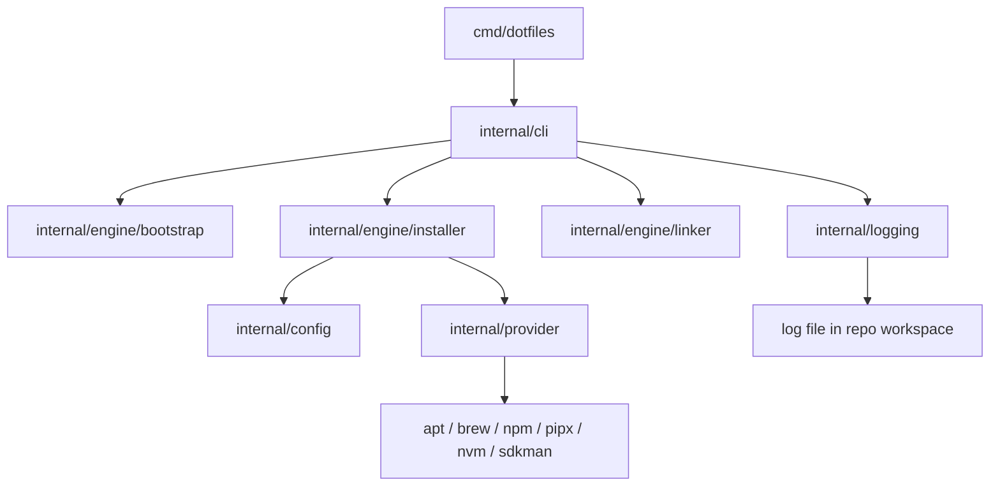

# Architecture Documentation

This repository contains the standalone Go CLI used to bootstrap dotfiles and install developer tools.

## Overview

The CLI is intentionally small and structured around three core actions:

1. `bootstrap` clones or updates the configuration repository.
2. `install` reads YAML tool definitions from `init/*.yaml` and runs provider-backed installation steps.
3. `link` creates symlinks from the configuration repository's `link/` directory into the user's home directory.

## Runtime Assumptions (V1)

- Local workspace path is fixed at `$HOME/.dotfiles`.
- `bootstrap --repository <url>` explicitly selects the remote source.
- Without `--repository`, bootstrap tries to reuse `origin` from the local `$HOME/.dotfiles` repository and prompts if none is available.
- Local path customization is postponed to a later version.

## Main Components

## Execution Flow

1. The root command wires subcommands in `internal/cli`.
2. Bootstrap resolves the target repository and workspace path.
3. Installation loads YAML files from the configured init directory.
4. Providers execute in priority order so system packages run before version managers.
5. Linking uses the repository's `link/` directory as the source of truth.

## Development Goal

The long-term goal is to keep this repository focused on executable behavior, while the user-specific dotfiles repository stores configuration and shell content.